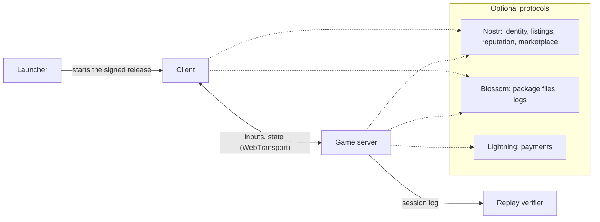

# Campfire

## Vision

An open-source (MIT/Apache-2.0) Rust engine for multiplayer games, with its server and client, plus importers that bring existing games onto it: a player imports a game from their own copy and plays it on Campfire's sim and network. Generals: Zero Hour is the first. Content is expected to come from the community. Anyone can host a server, create content and set their own rules; the project runs nothing and ships defaults, not policy.

Four pillars must all ship:

1. **Engine:** genre-free, deterministic, scriptable.
2. **Network:** one authoritative server per session, prediction, verifiable session logs.
3. **Bitcoin and Nostr:** identity, discovery, reputation and optional Lightning payments.
4. **Imported games:** Generals: Zero Hour first, so close to the original that no player notices a difference.

Docs: [Engine Core](02-engine-core.md) · [Game Scripting](03-game-scripting.md) · [Capabilities](04-capabilities/00-overview.md) · [Games](04-capabilities/games.md) · [Protocol Spec](05-protocol-spec.md) · [Research Notes](06-research-notes.md) · [MOBA test content](07-moba.md) · [Script API](08-script-api.md) · [Determinism Core](09-determinism-core.md) · [Sessions](10-sessions.md) · [RTS foundations](11-rts-foundations.md) · [Zero Hour](12-zero-hour.md)

## Guiding principles

- **Defaults, not enforcement.** Ownership checks, payments, character bans and rankings are options each host turns on.
- **Human trust over surveillance.** Anti-cheat lives on the server only, and an open-source client cannot be trusted. So the game is built first for people who trust each other; a host who opens a server to strangers relies on server-side checks and reputation, and players there, above all in wagers, play at their own risk. The default settings keep wagers and spectator bets off.
- **Protocols over platforms.** Identity, server listings, reputation and the marketplace use Nostr and Lightning, so no one, including this project, is a chokepoint.
- **Licensing.** Code: MIT/Apache-2.0, the importers and rules packages included. An imported game's content belongs to its publisher: it stays on the player's machine, and nobody distributes it. Community content picks its own license.

## Terms

| Term | Means |
| --- | --- |
| Match | A game with an end: waiting → running → ended |
| World | A persistent game that never ends |
| Session | One match or one world on one server, with one session id and one session log. A server restart continues the same session from its latest save |
| Segment | The part of a session log that starts at one checkpoint. A match with no save is one segment |
| Save | A checkpoint a player keeps, with the log before it, to load and continue the session later, on the same engine release or a newer one |
| Carry | Declared, typed data that leaves one session and enters another as a recorded input: a hero between missions, a character between play sessions |
| Campaign | Missions, each a mode, played in an order the carry opens, with their carry |
| Team | A side players and units belong to. A mode has any number of teams, and declares how each pair regards each other: hostile, neutral or friendly, and whether they share vision |
| Unit | Anything in the sim with a stable id, a position and a type: a hero, a soldier, a building, a projectile, an item on the ground, a door |
| Action | Anything a unit does on purpose: an attack, a cast, a shot, a use, a build; every action runs one pipeline |
| Tag | A word a unit carries, from its type or its modifiers; the mode says what a tag does, such as stop a unit moving |
| Params | Read-only values from data files (units, actions, modifiers) |
| Script state | Values scripts keep on units, players and the mode; part of the game state |

## System overview

Three programs share one deterministic engine: the client, the game server, and a replay verifier anyone can run on the packages a session names. Payments and ownership plug into the server as optional modules.

A small launcher starts the right client: a server names only an engine release tag, and the launcher fetches that release only if enough of the release keys it trusts signed it (for example 2 of 3), and refuses revoked releases. The launcher itself is signed for each operating system.

## Engine

The engine knows nothing about any particular genre; Zero Hour is just the first game imported onto it. It provides capabilities, one mechanism each (health and damage, units that take orders, a first-person character, fog of war, items), and a game declares the ones it needs: a MOBA, an FPS, or a mix that no genre names.

**Neutral core.** The core has no genre words and no genre lists: a mode declares its own damage kinds, stats, pools, tags, slot kinds, teams and relations ([Mode vocabulary](04-capabilities/00-overview.md#mode-vocabulary)). Every capability says its mechanism in one model of units, tags, stats, pools, modifiers, actions, effects, events, relations and space ([The model](04-capabilities/00-overview.md#the-model)), so a MOBA, a shooter, an RTS, an MMO and a battle royale are the same kind of package.

- **Deterministic:** the same inputs give the same result on every machine.
- **Configurable tick rate:** set by the host within the range the mode allows, up to 200 Hz or more on LAN, fixed for the whole session.
- **Platforms:** desktop only (Windows, Linux, macOS). On x86-64 the CPU must have the x86-64-v3 level (AVX2 and FMA: Intel from 2013, AMD from 2015). The client is 3D.
- **Tools:** importers, map and content editors, dedicated server and replay verifier.

## Multiplayer model

One server is the single authority for each match or world. Peer-to-peer was rejected because every player would hold the full game state, and fog of war could be read.

- **Players see only what they should:** hidden information never reaches their machine.
- **Every result is verifiable:** the server keeps a session log of every signed input. Anyone who holds its packages can replay it on the tagged engine release it names and confirm that the result follows from the logged inputs; an imported game's package needs a copy of that game ([Verification](05-protocol-spec.md#verification)). The log does not prove the host was fair: the host signs bot and external inputs, picks the tick each player input lands on, can drop inputs, and sees all hidden state. See [what verification proves](05-protocol-spec.md#verification).

**Anti-cheat** runs on the server only, never on players' machines: no kernel drivers, no scanning. Hosts get:

- every action is checked for being possible (range, cooldown, resources, line of sight);
- limits on action rate and on reaction times no human could achieve;
- detection plugins that read session logs after a match: aim snaps, reaction times, input patterns;
- community review: a reported replay goes to reviewers other players trust, as in Counter-Strike's Overwatch, and their verdicts are Nostr reputation statements;
- tools to review match records, flag suspicious identities and ban them;
- reputation and stake caps for new identities, for hosts that use payments.

## Scale: from matches to large worlds

The same engine supports three sizes of game. One server always owns its whole match or world. Servers never connect to each other; what they share, they share as Nostr events.

| Size | Example games | Players (goal) | How results are verified |
| --- | --- | --- | --- |
| Match | MOBA, arena, duel | 2–20 | Replay the whole match |
| Battle | Battle royale, large siege | 20–200 | Replay the whole match |
| World | Persistent MMO-style world | 1,000+ in one session, on one server | Replay any period from a saved checkpoint, after a delay |

A world is one session, whatever its size: its dungeons and battlegrounds are regions of the same sim. At 1,000+ players this needs deterministic multithreading, strict relevance and dormant regions ([World](04-capabilities/world.md)).

A world's log and checkpoints show hidden state that is still live, so the host publishes them only after a delay the host sets. A match publishes its log after it ends.

## Singleplayer and saves

A singleplayer game is a session with one player, on a server that runs as a thread of the client, as Minecraft's integrated server does since version 1.3: one code path for singleplayer, LAN and online play, so a fix to one is a fix to all. It needs no network, no relay and no payment.

- **Saves.** The player saves when the mode allows: a quick save, an autosave, or the mode's own save points; a hardcore mode allows only its own. A save is a checkpoint with the log before it; loading it starts a new segment of the same session ([Saves](02-engine-core.md#saves)).
- **Newer releases.** A save loads on the engine release that made it and on every later one: each release carries the converters from the save format before it, as Factorio and Minecraft convert old saves, one way. A converted save starts a new segment, and verification proves each segment on the release that recorded it.
- **Campaigns and characters.** What a hero, an army's research or a Diablo character keeps between missions or play sessions is the mode's carry: it leaves a session at its end or at a save, and enters the next as a recorded input, so each session still verifies alone.
- **Pause and game speed.** The sim never reads the wall clock, so a pause runs no ticks, and a game speed runs more or fewer ticks a real second; neither changes the sim or the log. A singleplayer session pauses at will; in multiplayer, the host's settings say who may pause.

Players move between worlds by leaving one server and joining another. Their identity comes with them; items and progress come with them only if the new server chooses to accept them. An item moves by burn and attest: the old server destroys it and signs a transfer that only the one server it names can redeem, once ([Item export](05-protocol-spec.md#item-export)).

## Scripting and modding

Characters, abilities, items, maps and whole game modes are content anyone can create. Packages hold scripts and data; mechanisms come from capabilities in engine releases, and a package may combine any of them.

Scripts are Rhai: sandboxed, deterministic and resource-limited. A game script gives the same result wherever the full sim runs: on the server, in the verifier, and in a client that plays back a published log.

**Content packages** bundle logic, balance data, art and sound, announced under the author's key and identified by a unique fingerprint, so same-named content never conflicts; an imported package has no author and no announcement, only its fingerprint ([Imported games](#imported-games)). Hosts pin exact versions, so an author's update reaches players only when the host chooses.

## Decentralized server network

No central server list or account system: Nostr provides both.

- **Identity:** a player is a Nostr key, used on every server to own items and receive payouts. The main key never reaches a server; it signs a short-lived key for each session ([Keys](05-protocol-spec.md#keys)). A published session log names the main key of every player in it, so anyone can list the matches a key played: the client lets a player keep several identities and choose one for each server, so play can be kept apart from a public profile; what a key owns, licenses and items, stays with that key.
- **Discovery:** servers publish signed listings (region, modes, content, rules, prices) that players browse; LAN servers also announce themselves on the local network.
- **Reputation:** players and servers publish signed statements after matches; each player chooses whom to trust. Servers may form groups that share bans, ratings and dispute handling as Nostr events.
- **Matchmaking** runs on each server.

**The host decides:**

- which game modes, maps and characters are allowed, and whether character or skin ownership is enforced;
- tick rate, player limits, and the reconnect grace period;
- which payment models are on, their prices and caps, stake rules and spectator betting;
- ranking, matchmaking and extra plugins.

Settings can differ per map or mode, so a free casual map can run next to a paid one.

## Lightning payments

An optional module, off by default. Hosts turn on the models they want and set prices; a map or mode may declare its own prices within the host's limits.

| Model | Who pays whom | Example |
| --- | --- | --- |
| Wager pool | Losing team → winning team | Every player stakes, the winning team takes the pool |
| Spectator bets | Spectators → correct spectators | Viewers bet on the outcome in a separate pool |
| Entry fee | Player → host | Pay to join a ranked match or tournament |
| Time-based | Player → host | Pay per minute on a premium world server |
| Per event, charge | Player → host | Pay to respawn, fast travel or enter a boss arena |
| Per event, reward | Host → player | Bounty for a boss kill, tournament prize |
| Item sale | Player → player | A player sells a sword found in a world to another player; the host may take a fee |

**Player consent.** Every price is shown before joining; nothing else can be charged. Time-based and per-event payments draw on a spending budget the player's wallet grants and can cancel at any time.

**Wager pools.** The host sets stake rules (equal or free) and payout split (even or by stake); the default is equal and even. A crashed match is restored and continues; it aborts only if its server is not back within the host's restore window, and an aborted match refunds everyone. Leavers lose their stake: a leaver sent a leave input or stayed disconnected longer than the host's grace period. The host decides whether bots may fill slots in wager matches; bot slots never stake, the listing shows the setting before anyone stakes, and the default settings keep bots out of wagers.

**Spectator bets** are off by default. The host sets when betting closes and the spectator delay; players in the match cannot bet.

**Who holds the money.** Each stake is a locked payment the host cannot take before the result, and it returns if the match aborts; at payout the players trust the host ([Payment flows](05-protocol-spec.md#payment-flows)). Above a stake the host sets, independent arbiters named in the listing replay the log and co-sign the result before it settles.

**Item sales.** A world records who owns each of its tradable items, by the owner's main key, and every change of owner is a recorded input, so the log proves an item's history. A sale for sats is an atomic swap: the buyer's payment settles only when the world has recorded the transfer, and neither the host nor anyone else holds the money in between ([Item sale](05-protocol-spec.md#item-sale)). No token on a blockchain records the item: what an item does exists only in the world that runs it, so that world is its authority either way, and an item is worth the trust in its world. An item of a singleplayer game, whose server is the player's own, has no value for trade. Which item types are tradable is the mode's choice, off unless it turns it on: Blizzard closed Diablo III's real-money auction house because buying gear had replaced finding it.

**Legal.** Real-money features are regulated or banned in many countries; hosts are responsible for how they use them. Random rewards that can be sold for money count as gambling in some, such as Belgium: a mode whose random loot is tradable for sats is in that zone.

## Character and skin ownership

Owning a character or skin means the right to pick it on servers that enforce ownership, not the files: every player needs the files to see opponents.

- **Optional:** hosts decide; the default settings enforce it for skins only.
- **Nostr licenses:** after a Lightning payment, a license key the creator delegated to a storefront signs a license, so the creator need not be online. A license belongs to the buyer's main key; losing that key loses its licenses. Other methods are not planned.
- **Marketplace:** creators list characters and skins on Nostr and sell them for sats; anyone can run a storefront.
- **Balance:** hosts decide which sold characters are allowed in ranked or paid games.
- **Creator revenue:** sales, plus a share of host fees for characters played that a host may choose to pay; the protocol cannot enforce it.

## Imported games

An imported game is a game players already know, rebuilt on Campfire's sim, so close to the original that no player notices a difference. The engine grows for the games it imports, Generals: Zero Hour first, then Worms 4: Mayhem ([Games](04-capabilities/games.md), [Zero Hour](12-zero-hour.md)).

- **From the player's own copy.** The `import` app reads a game's install and writes one package from it, the same bytes on every machine, so its fingerprint names it in a session as any package's does. Nobody distributes an imported package: each player, each server and each verifier makes their own ([Packages](05-protocol-spec.md#packages)).
- **Rules as content.** What a game shares with others is a capability; what only that game does is Rhai in its rules package, which holds no file of the game and ships with the importer. Only what Rhai cannot match, as a pathfinder or a game's movement, runs natively, behind one of the engine's backend interfaces ([Backends](02-engine-core.md#backends)).
- **Parity, measured.** The original game, built from its released source, plays the game's own replays and writes each frame's state; Campfire plays the same replays, and a test compares the two.
- **Written from the source.** The importers and rules packages are MIT/Apache-2.0, written from the original's released source, which is GPL; a release that ships them takes a legal check first.

**Design rule:** a rules package is an ordinary package. If a game needs something scripts cannot do, and no backend should, the scripting API is incomplete.

**The MOBA** in `source/packages/moba/` is test content: the tests and benches play it, and no player does ([MOBA test content](07-moba.md)).

## Milestones

All four pillars ship in 1.0; they arrive in this order, in the stages of the [roadmap](../../ROADMAP.md).

1. **Zero Hour on LAN.** First the determinism core, the prototype that proves the sim runs the same inside Lightyear and in a bare verifier, the game model in code and sessions that restore, built and tested with the MOBA test content. Then the `import` app and the parity oracle, then a Zero Hour skirmish with its AI on LAN or a local server, with verified replays and crash restore, within the parity measure. Players use local Nostr key files through the final delegation, handshake and session log formats; no relays, listings, launcher or payments.
2. **Open network.** Nostr listings, packages over Blossom and the import recipes listings name, reputation, ban lists, and the launcher with signed releases.
3. **Payments.** The optional `payments` module: entry fees first, then wager pools, then the rest. Item sales and item export wait for an imported game with a persistent world.
4. **More imports.** Zero Hour's campaign, from its map scripts, and the next games on the import list, each with the capabilities it needs at depth: Worms 4: Mayhem's `physics`, destructible terrain and the `spatial` metric first.
