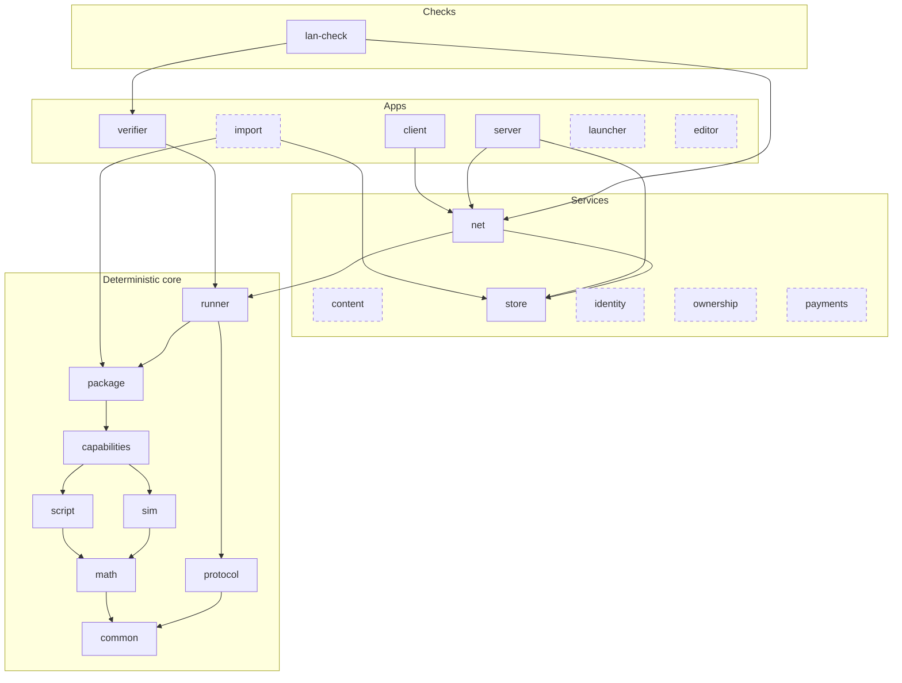

# Campfire — Engine Core

## Module map

Dashed: planned, as the table below marks it. `log` is left out: the binaries, `net` and `verifier` use it.

Each layer uses the layers below it.

## Modules

| Module | Status | Does |
| --- | --- | --- |
| `common` | built | The vocabulary that crates which do not depend on each other share: the player slot, ticks, segment seed and 32-byte values written as hex, a package's fingerprint, and the binaries' exit statuses |
| `math` | built | Fixed-point numbers, 3D vectors, trig, exact 256-bit products, counter-based RNG |
| `protocol` | built | The open protocol: signatures, session key delegations, the connection's handshake, input chains, the seed chain and the session log, with no IO ([Protocol Spec](05-protocol-spec.md)) |
| `sim` | built | Deterministic state and systems on `bevy_ecs`; no genre code |
| `script` | built | The Rhai host: compiles scripts, and runs each call under its limits; the script API itself is in `capabilities` ([Script API](08-script-api.md)) |
| `capabilities` | built | Mechanisms a mode combines, a module each: `combat`, `navigation`, `orders` and the rest ([Capabilities](04-capabilities/00-overview.md)) |
| `package` | built | Reads a mode's packages and every package it depends on, each file a session needs on demand and checked against its package's index, and runs the load checks of [Script API](08-script-api.md) |
| `runner` | built | Builds a match from checked packages: wires `sim`, the declared capabilities and `script`, feeds inputs; owns `SessionRules`, which builds a session's terms from the packages and checks terms on the server, the client and the verifier |
| `verifier` | built | CLI: replays a session log segment, checks the result |
| `lan-check` | built | The real server and bot clients over WebTransport on `127.0.0.1`, on request ([Testing and diagnostics](#testing-and-diagnostics)) |
| `server` | built | Host config, lifecycle, saves, validation, admin; a headless app, and a library the client runs on a thread for singleplayer |
| `net` | built | Lightyear over QUIC (WebTransport): handshake, replication; internal |
| `log` | built | The binaries' log output: text on standard error, and JSON lines into a file; the events a tool reads back from those lines; the end of a command line clap refuses or answers with its help |
| `store` | built | Durable and secret files, data directories and their locks, and the worker threads that write them, each with its failure ([Storage](#storage)) |
| `launcher` | planned | Small app: fetches, checks and starts the engine release a server or replay names; server browser |
| `client` | built | Bevy app: rendering, input, UI, audio, prediction; the presentation systems that draw a game from its data ([Zero Hour](12-zero-hour.md#the-client)) |
| `import` | planned | App: reads a game's install through `store` and writes one reproducible package, a module for each game ([Zero Hour](12-zero-hour.md#the-importer)) |
| `content` | planned | Package signatures, pinning, cache, Blossom fetch |
| `editor` | planned | Map and content editors |
| `identity` | planned | Nostr keys, session keys, listings, reputation |
| `ownership` | planned | License checks (optional) |
| `payments` | planned | Pools, hold invoices, wallet budgets (optional, separate repo) |

A module is built when the workspace has its crate, `campfire-<module>` in `source/crates/` or `source/checks/`, and planned when it does not yet. A test fails when this column and the workspace differ.

`sim` is pure: state and inputs in, next state out; no files, packages or signatures.

`lan-check` is a check, not an engine crate: it lives in `source/checks/`, apart from `source/crates/`, and nothing depends on it. Each crate's folder has its package's name, `campfire-` and the module: `source/crates/campfire-math/`, `source/checks/campfire-lan-check/`.

Dependencies: `server` and `client` → `net` → `runner`; `import` → `package` and `store`; `server`, `client`, `net`, `package`, `verifier` and `lan-check` → `store`, and `runner` under its `internals`, for its golden files; `verifier` → `runner` → `package` → `capabilities` → `script`, `sim`; `runner` → `protocol`; `script` and `sim` → `math` → `common`; `protocol` → `common`. `store` depends on no engine crate, and no crate of the deterministic core depends on it. `log` depends on `common`, for the `ExitStatus` a command line ends with, and, under its `start` feature, which only the binaries turn on, on `store`, whose worker writes its JSON file, so no crate of the core reaches `store` through it; the binaries, `net`, `runner` and `verifier` use it, and the tests of `sim`, `capabilities`, `common` and `log` use `store`'s internals. The runner joins `protocol` and the packages, which name a package by the one `Fingerprint` of `common`. A type enters `common` only when two crates that do not depend on each other both name it, and only as a plain value: construction, parsing, display and serde, and no other logic. `common` depends on `serde` and `derive_more` alone. Within `capabilities`, a module imports only from the capabilities below it.

**Game-bound code.** Code that serves one imported game, and no general use, lives in a module named after that game, in the crate whose interface it serves: Zero Hour's importer in `import`'s `zero_hour`, its pathfinding and movement backends in `capabilities`' `navigation::zero_hour`, its AI in the `zero_hour` module of the crate that drives server bots. The name tells a reader that the module is not general. Nothing depends on a game's module but the one place that installs it, as a mode names its backends; a mechanism a second game needs moves out of the game's module into a general one.

Outside the engine crates: the MOBA test content, the rules packages of imported games, and bots. The tests of `package` and `runner`, and `lan-check`, use the MOBA and the bots as test content; nothing else in the engine depends on them. Bots produce inputs like players, so replays never depend on bot code.

## Structural rules

These rules keep the code's structure from drifting. Each has a test that fails when it is broken, because a rule that only a review checks drifts again.

| Rule | Enforced by |
| --- | --- |
| One owner for each fact. A fact from the packages lives in one immutable book; a fact of the match lives in state; a fact of the running call lives in the frame. Nothing else holds a copy. | The state table test; the behaviour golden |
| A name becomes an id where it enters. After the load, no system looks up a name; a script call resolves its name once per call, with no allocation. Every lookup of an id by its name is a method whose name ends in `named`, so each call of one can be found. | The book builder's tests; the allowlist test of name lookups, which lists each file that calls one |
| The load refuses everything a match can refuse. A match start fails only on session terms: players, tick rate and seed, and the packages they name, which the store must hold and which must load; and on the mode's `on_match_start`, whose runtime failure no load can foresee. | `StartError` has no case of a package's data: its cases are the seed's, the terms', the store's, a slot rule's and the start call's |
| A layer calls a higher layer only through a hook the higher layer registers: a capability adds to the script view through its column, to a call's frame through its part, to a call's effects through its effect types, each of which applies itself, and to the script API through its row of the capability table. | The layer test |
| Every order that matters is by stable id, and every rounding uses one helper. A system that spends something shared, takes ids or runs scripts walks its units through `Ordered`, a scratch that sorts the entities of its query by stable id: a query gives them in archetype order, which a component added to one unit, or a restore, changes. | The archetype-shuffle test |
| Each tick's work has a fixed limit, or a cost in proportion to the units that take part: no tick pays for a scan or a rebuild the other ticks do not. | The work record; the navigation bench |
| Restored state is checked like package data: a restore gives an error for every flaw, never a panic, and what it accepts plays on without one. Its times and counts stay within what a match makes: the tick, every time and every count are at most 2⁶², which no match reaches, so no sum of two overflows; every period is at least a tick; and every relation a system takes between two restored values, or between one and the books, holds, as the start of an attack under way, its resolve less its windup, is no sooner than tick 0. | The decode of `Tick` and `Ticks`, which refuses a time or a length past 2⁶², so no check repeats it; every state type's check, a required method of the state traits, which the compiler proves; the snapshot fuzz, which flips each byte of a proving match's snapshot, restores it, and plays five ticks on what restores; the structured fuzz, which puts into that snapshot values of each state type its decode accepts, the edges of every number among them, and does the same; a restore test at the limits of each state type's times and counts |
| Each rule of a network session has one owner on each side, and a client that follows the rules is never refused. | The net scenarios under load |
| `common` depends on no crate but `serde` and `derive_more`. | The manifest test of `common` |
| Only `store` touches the file system or starts a thread ([Storage](#storage)): it reads, lists, checks and writes every file, of production code, tests and checks alike; the deterministic core touches no file and starts no thread. | `disallowed-methods` and `disallowed-types` in `clippy.toml`, which fail the check chain, and the test of `common` that checks every exemption |
| Code that differs by OS lives only in `store`'s `platform` module, behind one interface that keeps one promise on every OS ([Platform](#platform)). | The platform rule test of `common`, which scans every source file of the workspace |

**Books.** A match's books are built by one pure function of its packages and a tick rate, with no world: the unit types and their tags, the tracks, the modifiers and the actions with their params and effect lists, the AIs, and the projectile and area specs. The package load calls it at the fastest rate the manifest allows, where a time counts the most ticks, so what the books cannot hold fails the load; a match calls it at its own rate and puts what it gives in place. The order of every id is the order the builder loads in: the tags, the tracks, every package's modifiers, then each package's actions and unit types, the mode's first. A script is named by its place in the order a match compiles them, and the hooks it defines come from what the load read of it, so no book needs a script host.

## Capabilities

The core has no genre code; a mode combines capabilities, one native mechanism each: [Capabilities](04-capabilities/00-overview.md).

## Lifecycle and sessions

- Engine states: **waiting** (players connect, packages load, start gates pass) → **running** → **ended** (result or aborted; the log is sealed, end hooks run).
- Start gates and end hooks are how optional modules join the lifecycle; the engine has no money code. The `payments` module adds a start gate that locks stakes and an end hook that settles them.
- Everything inside running (pick, rounds, buy time, overtime) is defined by the mode script.
- `ctx.end` is optional: a persistent world never calls it.
- How a session outlives its process, its links and its players: [Sessions](10-sessions.md).
- A session outlives the server process. A match restores by replaying its own log from its latest checkpoint, from tick 0 when it has none; a world loads its latest checkpoint and replays the log after it. Players reconnect with the same main key; a new session key is a renewal the log records.
- A session pauses by running no ticks, and runs at a game speed by running more or fewer ticks a real second; the sim reads no clock, so neither enters the log. Who may pause is the host's setting, and always the player in singleplayer.
- The server writes each input to the log before its tick runs and flushes the log from a background thread, so no tick waits on the disk; a crash loses at most the unflushed inputs, and clients resync to the restored state.
- A match that is not back within the host's restore window aborts. The window must end before any stake's hold invoice expires; a window of 0 means a crash always aborts.
- Script state is versioned; migration hooks convert saved state when a package version changes at restart.

## Inputs

Anything from outside enters the sim as a recorded input: player inputs (commands, each in its capability's format), bot inputs, player connects and disconnects, carry loads, admin commands, payment events, calendar time. If it is not in the log, the sim cannot depend on it.

Clients can join a running game at any time; they receive the current state of what they can see.

## Session log

- A match with no save is one segment; a persistent world checkpoints every few minutes, and every save is a checkpoint. Format: Protocol Spec.
- The verifier replays any segment from its checkpoint. Hosts set how long logs are kept.
- **Snapshot:** the postcard encoding of every sim component and resource, entities sorted by stable id, component types in an order the engine release fixes, script state maps sorted by key. Its format belongs to the engine release, not the protocol, and carries a data version, `StateRegistry::DATA_VERSION`, a little-endian `u32` after its tag, which a release raises whenever it changes the format, a type's layout included, as Minecraft's `DataVersion` is: a restore refuses a snapshot of another version with `SnapshotError::OtherVersion`, which names both, before it reads a type. The `state` section of `sim`'s golden digests hashes a snapshot's own bytes, so a change of the format moves it, and the runner's goldens name the version when a change of layout alone moves their state.
- **State hash:** one BLAKE3 hash for each state type over the same bytes the snapshot holds, then one hash over the list of `(name, type hash)` ([Determinism Core](09-determinism-core.md)). The goldens compare it on every tick, on every OS in CI, and at the first mismatch the per-type hashes, to name the first divergence.
- **No slow tick for a checkpoint:** at the tick boundary the server copies only the components changed since the last checkpoint; a background thread applies them to its copy, encodes and hashes it, and writes the checkpoint record when done.

## Saves

A save is a checkpoint a player keeps: the snapshot at a tick boundary, and the session log before it. The player asks for one with a command, the mode with `ctx.save()` or at its `[saves] autosave_ms`; a mode that sets `[saves] by = "mode"` refuses the player's, as a hardcore mode does. A save costs no slow tick: it is written as every checkpoint is, from a copy, on a background thread.

- **Load.** Loading a save restores its snapshot and starts a new segment of the same session from it; the log after the save is dropped, so a load goes back in time. A singleplayer session may load any of its saves.
- **Converters.** A save loads on the release that made it and on every later one. Each release carries a converter from the data version before it, which rewrites a snapshot one way, as Factorio's map versions and Minecraft's DataFixerUpper do; loading an older save runs the converters in order. A release may drop the converters older than a point it names, and the launcher then fetches the last release that had them to convert in two steps. Script state converts by the packages' `state_version` and migration hooks, as for a world.
- **Verification.** A segment verifies on the release that recorded it, from its checkpoint. A converted save starts a new segment whose checkpoint the converter made outside the sim: the log names the release before and after, and the proof of the earlier segment ends at the conversion.
- **Carry.** The mode declares a carry schema, typed and versioned like script state. `ctx.carry` reads the carry the session loaded and writes the carry it will hand on; the server writes it out at the session's end and with each save. A session loads a carry as an external input at its start, so its log holds everything it read. A campaign's next mission, and a Diablo character's next play session, start from it.

## Storage

`store` owns how files are read, listed, checked and written and how threads run; the crate that defines a file's bytes owns what they hold. `store` depends on no engine crate. One layer for all file I/O gives each read and write one place to keep its promises, a bound on what it reads, a refusal of a link, a durable write, and one error of cases for each failure, so no caller re-learns them, and a test meets the same rules as the code it tests.

- **Durable files.** `DurableFile` writes a temporary file, syncs it, renames it over the target and syncs the directory; each step's failure is its own error, never retried ([D9](10-sessions.md#decisions)). `DurableFile::create_dir_all` makes each missing directory above a path, and `create_new_dir` one only where nothing holds its name, as a run's directory is its own. `SecretFile` is a durable, owner-only file ([Platform](#platform)): the server's key, its TLS identity and a client's `--key` file are secret files. It is the secret's path as a value, made from a path where the path enters, a data directory's or a command line's; it reads and writes the file and gives no `&Path` back, so code that holds a secret cannot pass it to `fs::read`.
  - **Read.** A read opens the file, following a link as OpenSSH does, and checks the open handle, so the file checked is the file read. It refuses, each as its own case: a file that is not there; one that is not a regular file, as PostgreSQL refuses its `ssl_key_file`; one others may open, as OpenSSH and PostgreSQL refuse a key; and one longer than the most its caller takes, as OpenSSH caps a key file, which it reads no further than one byte past that most.
  - **Create** writes a new secret and never replaces one: its bytes go to a temporary file of its own process and thread, which takes the secret's name only if no file holds it, so of two processes that make one key at once, one makes it and the other reads it. A key is only ever created, so no code path overwrites one.
  - **Replace** writes as `DurableFile` does, for a secret its owner renews under its data directory's lock: the TLS identity whose certificate nears its end.
  - **Zeroed.** The bytes a read gives, and the bytes a caller encodes to create or replace a secret, are `zeroize`'s `Zeroizing` buffers, which overwrite their memory when dropped, as OpenSSH's `explicit_bzero` does a key's. A read allocates its buffer once, at the most its caller takes and one byte, so no growth leaves a copy in freed memory. The decoded key stays in memory while the process runs, outside this rule: the `secp256k1` `Keypair`, which is `Copy`, and the TLS identity's key, which `wtransport` holds.
- **`protocol` does no IO.** The session log writes framed records into a `RecordSink` and takes the durable count from its caller, so it runs with no disk and no thread, a browser's verifier included. `net`'s `SessionJournal` implements the sink over `store`'s `AppendWriter`.
- **Workers.** Every thread starts through `store`'s `Worker`: named, closed when its handle drops, and joined; a handle dropped during a panic does not join, so a crash ends the process at once. One thread per job, so a snapshot's write never delays the journal's sync. The queues are `AppendWriter` (a stream with grouped syncs and a durable count), `StreamWriter` (a stream with no sync and a bounded buffer, a caller waiting while it is full, as the JSON log file needs), `Exchange` (one job in flight) and `LatestWriter` (the newest value only); none waits for the disk or allocates in a steady state.
- **Data directories.** `DataDir` exists only while it holds its directory's lock, so a second server or client on one directory is refused, and it gives every path in it from typed ids. An existing directory that others may open is refused, as Tor refuses its `DataDirectory`: one others may write lets them remove a secret, which the server then makes new, and replace a session's files.
- **Errors name their path.** Each error of `store` names the path it concerns beside its case, as the `fs-err` crate adds paths to std's, so a caller logs it as it is and wraps no path of its own: `CheckError::File`, `ContentError::Scan` and `OrderScriptReadError::Read` lose theirs.
- **Reads.** `InputFile` reads a file whole, never past a bound that its format's owner names and derives from that format's own limits, each with its reason: `SessionLog::MAX_FILE_LEN` for a log and a journal, `StateRegistry::MAX_SNAPSHOT_LEN` for a snapshot, `SessionPrivate::MAX_FILE_LEN`, `Nsec::MAX_FILE_LEN`, `OrderScript::MAX_FILE_LEN`. `read` gives the bytes; `read_if_present` none for a missing file, as a restore and a process log take one; `read_text` UTF-8 text; `read_stamped` the bytes and the file's time of change, both from one open handle, as the journal's restore takes them; and `stream` an `InputStream`, its length and its bytes in pieces, as a package reads a file on demand, no further than its index's row, and checks it against that row. Its error, `ReadError`, is `Missing`, `NotFile`, `NotDir`, `TooLarge`, `NotText`, `Exposed` and `Read`, one type for every read, each case but the last given by the calls its doc names. A read checks the path's kind before it opens, as PostgreSQL checks a key file's, since an open of a pipe waits for a writer, and the handle's after; it reserves the length the handle's metadata gives, once, and reads at most one byte past the bound, so a file that grows as it is read is refused, not read without end. `SecretFile::read` shares the read, and adds `Exposed` and its zeroed buffer.
- **Listings.** `DirEntries::read` gives a directory's entries sorted by their names' bytes, each with its kind as the entry is, a link not followed: `File`, `Dir`, `Link` or `Other`; a missing directory is `Missing`. No call asks whether a path exists: a caller lists the directory once, as the session scan lists `sessions` and `logs` once each instead of probing each session's published log, so the answer for every name comes from one moment.
- **Child output.** `OutputFile::stdio` makes a new owner-only file and gives it as the `Stdio` a child process writes to, as the LAN check's processes write their standard error, so no `File` leaves `store`.
- **Layouts.** A data directory's paths are a layout type of their own, `ServerLayout` and `ClientLayout`, made from a path; `ServerDir` and `ClientDir` hold the lock and give their layout. A tool that reads a finished run's directory it does not hold, as the LAN check's `verify` does a run another platform played, reads it by its layout alone, with no lock to take and no access to check, since the run's secrets are not its own.
- **Scratch.** A test's files live in `store`'s internals' `Scratch`: a temporary directory that is its owner's only, so a data directory opens in it, removed when it drops, under the system's temporary directory or under one a test names. It makes, reads, lists, renames, links, exposes and removes its files, and gives an entry's `EntryKind`, by a path within it, relative to its root or absolute under it as the code a test runs gives one, which it asserts, so no test reaches out of it; each of its calls panics with the path on a failure, as a test wants. A test writes a fixture through it, a bad file included, and reads what the code wrote through it, or through `InputFile` with the format's bound. A test that reads the workspace's sources reads them through `SourceFiles`, and its packages, design and golden files through `InputFile` and `DirEntries`, as production code does; a test that races two writers runs them through `Race`, which starts its threads within `store`.
- **Faults.** A worker's failure is an enum of the step that failed, given once; `store` decides no policy. `net`'s `Faults` applies it: a journal or snapshot failure ends the server with exit code 74, and a failed receipt is logged. A sync slower than a second is logged as `JournalSyncSlow`, and the server plays on.
- **Enforced.** `source/clippy.toml` bans by type what holds a file, `std::fs`'s `File`, `OpenOptions`, `DirBuilder`, `ReadDir`, `DirEntry` and `Metadata` and `tempfile`'s `TempDir` and `NamedTempFile`, under `disallowed-types`, so every method of each is banned, a new one included; and under `disallowed-methods` `std::fs`'s free functions, `Path`'s probes, `exists`, `try_exists`, `is_file`, `is_dir`, `is_symlink`, `metadata`, `symlink_metadata`, `read_dir`, `read_link` and `canonicalize`, `tempfile`'s functions and the thread starts. Only `store` is exempt, by its crate root's `expect` of both lints; the one other `expect` of `disallowed_methods`, on its statement, is the sim schedule's build settings in `sim_update`, which the same lint bans for another rule. A test of `common` checks both lists and refuses any other `expect` or `allow` of either lint, an integration test's root included. Bevy's asset server reads no file of its own: the client's assets reach it through a package asset source, whose reader reads through `package` and `store` and checks each file against its package's index ([Zero Hour](12-zero-hour.md#the-client)).

## Platform

One promise on every OS. Code that differs by OS lives only in `store`'s `platform` module, one file for each OS family, `platform/unix.rs` and `platform/windows.rs`, behind one interface. No other module, crate, test or bench names an OS: no `cfg` or `cfg!` of `unix`, `windows`, `target_os` or `target_family`, and no `std::os`. Each entity of the module keeps the same promise on every OS, and neither its errors nor its data name a concept of one OS, as a Unix mode. A promise one OS cannot keep is narrowed for every OS, never kept on one alone.

- **`OwnerOnly`** makes a file or a directory that only the current user may open, and checks that a file is so. On Unix, mode 0600 for a file and 0700 for a directory, given as it is made; a file is owner-only when its owner is the process's effective user or root, who may open any file, and its mode grants its group and others nothing. On Windows, a security descriptor given as it is made, whose DACL is protected from inheritance and holds one entry, full access for the user of the process's token, which a directory's children inherit; a file is owner-only when its owner and each entry that allows access name that user, SYSTEM, Administrators or TrustedInstaller, as OpenSSH for Windows checks a private key; an allowing entry of a kind OpenSSH passes over, which names its account another way, counts as another's, and a file with no DACL is open to all. The check reads the handle of the open file, so the file checked is the file read. Who else may open a file comes back as human text, as the OS names them: on Unix its mode, as `mode 640`, and an owner who is another user, by its id; on Windows the accounts' names.
- **`DurableName`** gives a file its name, replacing the file of that name, so the name survives a crash: on Unix a rename, then a sync of the directory; on Windows `MoveFileExW` with `MOVEFILE_REPLACE_EXISTING` and `MOVEFILE_WRITE_THROUGH`, as Python's `atomicwrites` does, where `fs::rename` passes no write-through. It also syncs a directory that gained or lost an entry, so the change survives a crash: on Unix with `fsync`; on Windows with `FlushFileBuffers` on a handle of the directory opened with write access and `FILE_FLAG_BACKUP_SEMANTICS`, a full flush, which the native `NtFlushBuffersFileEx` accepts for a directory, and whose refusal is a failure like any other. A failed rename is never retried ([D9](10-sessions.md#decisions)): a file another program holds open, as a virus scanner may on Windows, ends the server, and its supervisor starts it again. It also gives a file a name only when no file holds it, as `tempfile`'s `persist_noclobber` does: on Unix `link` then `unlink` of the temporary name, which POSIX makes fail when the name is taken; on Windows `MoveFileExW` with `MOVEFILE_WRITE_THROUGH` and no `MOVEFILE_REPLACE_EXISTING`.
- **Test helpers**, in `store`'s internals: `SecretFile::expose` and `Scratch::expose`, which let other users read a file, mode 0644 on Unix and an entry for `BUILTIN\Users` on Windows; `FileLink::make`, which makes a link to a file; and `OwnerOnly::exposure_at`, which checks a file or a directory by its path, as `Scratch::exposure` gives it. A test of a promise runs on every OS through them, with no `cfg`.
- **Unsafe code.** The module is the one place of the workspace that holds `unsafe`: the Windows file calls the Win32 API through Microsoft's `windows` crate, whose results and owned handles spare it the checks and frees by hand, and the Unix file asks `libc` for the process's effective user, which std does not give. Each file allows `unsafe_code` with its reason, and each block says why it is sound. The crate turns its error into an `io::Error` that holds the HRESULT, whose kind std does not know, so the module gives std the Win32 code that the HRESULT wraps.
- **Not in `common`.** `common` depends on no crate but `serde` and `derive_more`, and only `store` writes a file, so the module lives in `store`; another crate reaches the OS only through `store`'s types.
- **The same result on every OS**, where no code differs by OS: a package path names only a file that every OS holds as the same file's ([Package paths](03-game-scripting.md#game-package)); each walk of a directory sorts its entries before it reads them, so the same tree gives the same result, its error included; and a process's end is std's `ExitStatus`, whose text std gives.
- **Enforced.** A test of `common` scans every source file of the workspace, and fails on a `cfg` that names an OS or a path through `std::os` outside `store`'s `platform` module; the manifest of `store` alone names a Windows dependency.

## Scripting

`script` is its own crate in the deterministic core, so `sim` is testable without Rhai. Scripts run inside the sim tick; the API they call is the registry's ([Script API](08-script-api.md)).

- **Narrow game API.** Scripts never touch the ECS; they call the script API.
- **No `bevy_mod_scripting`.** It exposes all Bevy types and [pins Bevy patch versions](https://lib.rs/crates/bevy_mod_scripting_script).
- **Rhai engine:** `Engine::new_raw` with only the packages scripts need, in strict variables mode ([Engine enums](08-script-api.md#engine-enums)); no `eval`, imports, floats or time; `print` goes to debug logs only; a fixed hashing seed; never `unchecked`.
- **Operation limits:** a limit per call, and per-tick pools, which the manifest sets; counts are the same everywhere, so an over-budget script fails the same everywhere. A property a type reads through its indexer, as `ctx.p.damage` or `unit.params.aggro_range`, costs one operation, as a getter does: the host gives each such type a getter and a setter of each property name its scripts use, which call the indexer, as Rhai would try a getter first, build an error message, and only then call the indexer. A method of a value or a handle, as a position's, a vector's, a unit's or the map's, takes it as a copy: Rhai feeds a value a method may change back through the setter of the property it came from, as `d.target` or `ctx.map`, and these have none, so it would build two error messages and spend two operations more. Each hook runs in one pool:

  | Pool | Hooks |
  | --- | --- |
  | The player's, one per player slot | The calls that player causes: an action of a unit the player controls, its deliveries and modifiers, the player's quests and dialogue |
  | `think` | AI: `on_think`, `on_heard`; the hooks of an action or modifier whose source no player controls, or is gone |
  | `mode` | The mode's hooks: timers, inputs, deaths, region events, `on_level_up`, `on_wake`; a modifier with no source |
  | `systems` | `on_system` |
  | None, only the limit per call | `calc_damage` and `calc_heal`, pure and called once for each damage and each heal, so a crowded fight cannot spend a pool and change how they weigh ([Combat](04-capabilities/combat.md#damage-and-heals)); `on_generate`, under its own larger limit per call, `generate`, since it builds a region in one call |

  A call that finds its pool spent waits and runs first in the next tick, as AI and scripted systems do; a hook that cannot wait, a pure one, has no pool.
- **Other limits** (call depth, sizes) are engine constants, set explicitly, since Rhai's defaults differ between debug and release builds.
- **All or nothing per call.** State writes go to an overlay the call can read back; engine effects (damage, spawn, orders, timers) are queued. On success the overlay commits, then the effects apply in call order. Each capability keeps its own effect types in the call's frame, one queue a type, and each type applies itself: the queue records with each effect the apply of its type, so the script runtime names no capability, and no table can pair a type with another type's apply. On failure (error, overflow, limit) both are discarded, the sim emits a `script_error` event, and the tick goes on.
- **No hidden script state.** It is declared in a typed schema and stored in sim components; see [Script state](03-game-scripting.md#script-state).
- **Measured** (one core of a Ryzen 7 6800U): a hook call through `ScriptHost::call` costs 63.2 ns with an empty body, `script/call`, and 384 ns when the hook makes one call to a function the host registered, `script/native`, so each such call, as each `ctx` query is, costs about 321 ns, 5.1 times the hook's own. The AI's `on_think` calls take 43 % of a 3v3 tick. Each batch of script calls reads the script view first: 72 ns a unit when every unit moved since the last read, `script_view/read`, and 33 ns when one unit in a hundred changed, `script_view/reread`, where a read that fills every row took 1.21 µs a unit.
- **The script view keeps what did not change.** A read fills again only the parts of a row whose source's parts changed since the last read, the core's or a capability's, and copies the rest of the row from the read before, column by column, each run of rows that follow one another at once; a row no source fills again joins one run for every column. Each source finds its changed units through a Bevy query of `Changed` filters, one for each part it reads, which its parts' type derives, so a source cannot read a part whose change the view misses; a part that comes or goes moves the unit to another archetype, which the view compares, and a unit new to the view fills whole. A source's fill sees only the unit's parts, its column and the view's relations: what else a column's rows derive from, as combat's life pool, the column checks as each read starts, and a change of the relations, a book shared at load, or Bevy's check of the world's change ticks fills every row: the check clamps each tick older than Bevy compares exactly, but not the last read of the view's own queries, so an observer of it makes the next read whole. A debug build reads a second time with every row filled, and fails when the two reads differ.

## Backends

Collision, pathfinding, movement and visibility each have one interface and pluggable backends, chosen per mode: [Navigation](04-capabilities/navigation.md), [Vision](04-capabilities/vision.md). Movement is how a unit follows its route each tick; its default is local steering, and an imported game's own movement is a backend of it ([Zero Hour](12-zero-hour.md#decisions), D3). Collision, within each layer bodies move on: circles on a plane (now), static 3D level geometry, or `physics`. A physics backend may use strictly deterministic floating point inside itself, such as Rapier's [`enhanced-determinism`](https://rapier.rs/docs/user_guides/rust/determinism/) mode, pinned per release and checked by the goldens on every OS; everything else stays fixed-point, and a NaN panics before it reaches a snapshot.

## Bevy

- `sim` depends on `bevy_ecs` only and is one schedule, which runs on one thread whatever features a build turns on: a tick's systems are too small to share, and Bevy's parallel executor made a 3v3 tick cost 2.5 times as much. The server and client run it inside Lightyear's fixed tick; the verifier and the tests run it in a bare `World`. The server never links the renderer. Pinned to [Bevy 0.19](https://bevy.org/news/bevy-0-19/); the script API and protocol expose no Bevy types.
- Sim systems touch only sim components, so Lightyear's components cannot change a result.
- A world that runs ticks with no `App` to update it, a replay, a verification, a session's abort, a server's restore before its first frame, the runner's `Arena` and `RestoreTarget` and the capabilities' `TestMatch`, clears its change trackers after each tick, `Session::run_tick_alone`, as an `App`'s update does each frame, so its removed-component messages hold the tick's removals alone and a long replay holds them in bounded memory. A server's and a client's own ticks run in their `App`, which clears them once a frame, after Replicon has read them. The sim reads no removed-component message and tracks its own changes, so its state is the same either way; the proving match checks after each tick that the messages hold its removals alone. A bench that times the schedule runs it alone, with no clear, so it times the tick and nothing else.
- The server records the inputs received since the last tick, then runs the tick. It hashes the state at checkpoints and at the result; a hash after every tick is opt-in.
- Each unit replicates to the clients whose vision group sees it. What only its owner's prediction reads, where it respawns and when, its route and its progress along it, and its modifiers' clocks, goes to the owner's client alone, through a component-scope visibility filter of `bevy_replicon`. A client predicts only what its player controls (position, destination, death and respawn), with no input delay: Lightyear keeps its tick ahead of the server's present tick by half the round trip, a jitter margin, a sync error margin and one tick, so its inputs land in time; it is a full round trip ahead only of the newest server state it holds. A rollback reruns the sim from the server's state. It predicts movement, never a random outcome. The client builds the same books as the server from the packages it holds, at the rate the server's listing names, and installs them with the part of the mode no script runs: the map's metric, bounds, relations and pathing grid, and combat's bindings. So it predicts by the rules the server runs, and keeps no copy of its own. It derives its units' stats, tags and step from their type, level and modifiers, which the server sends, and starts their actions through the core's checks: an attack's or a cast's windup, and the cooldown when it goes off. It runs none of their effects, and no script: damage, launches, costs and a cast's effects come from the server. The server sends the teams' relations as a script changes them, as the client's targets and filters read them. It drops each sent input older than the deepest rollback Lightyear takes.
- `client` draws each unit with its own entity, interpolated between ticks; floats (`Transform`) exist only there.
- **Measured** (one core of a Ryzen 7 6800U): a packet's signature costs 17.5 µs to sign and 25.6 µs to check, `chain_head/sign` and `chain_head/check`; a 3v3 tick at 20 Hz costs 114.4 µs on average and 0.83 ms at worst, `server_tick/mean_3v3` and `server_tick/worst_3v3`, but the first, which builds the schedule and the pathing grid's labels, 1.64 ms, `server_tick/first_3v3`; a re-simulated tick of the lane 1v1 costs 9.4 µs, `client_frame/walk_rollback` less `client_frame/walk` over a rollback's 4 ticks. A 3v3 server tick with 6 packets costs at most about 1.0 ms of its 50 ms, and the first about 1.8 ms. A client's re-simulated 3v3 tick costs 23.0 µs, `client_frame/walk_rollback_3v3` less `client_frame/walk_no_rollback_3v3` over a rollback's 3 ticks, so an 8-tick rollback at a 200 ms round trip costs about 0.18 ms.

**Determinism rules for `sim`** (numbers, RNG and the state hash: [Determinism Core](09-determinism-core.md)):

- One fixed-tick schedule in ordered stages. A pass over what a stage changed runs in the `SimEdge::After` of that stage, and one over what changed between ticks in `SimEdge::Start`; a test fails a system of the proving match's schedule in no stage and no edge set, which would run in a gap in an order Bevy picks. Two systems with conflicting access and no order fail the build. So does a system or set that joins a set it already sits in through another: Bevy only warns of that redundant edge, and a warning fails no test that does not read it. A test builds the proving match's schedule with no automatic sync points, which Bevy adds between systems and which order them in passing, so every order the sim relies on is stated.
- Stable entity ids, never Bevy `Entity`, for the protocol, replays and every order that matters; Bevy [does not guarantee query order](https://docs.rs/bevy_rand/latest/bevy_rand/tutorial/ch02_basic_usage/index.html).
- Positions are 3D and fixed-point, 1 unit = 1 meter, within ±2²⁰ m. No floats outside a physics backend, no randomly seeded hash maps, no wall clock. An overflow panics in every build.
- The RNG is a cryptographic PRF, so clients cannot recover the seed from outcomes. A random value that decides an outcome never reaches a client before the log is published: clients predict effects, never results.

## Creator tools

- **Data schemas.** A JSON Schema for every data file is generated from the same types the engine reads, as the script API reference is generated from the registry, and a test fails when the checked-in schemas differ; an editor such as VS Code then completes and checks a package's TOML as a creator types. Generating them needs a schema crate, to be chosen and approved when the work starts.
- **Hot reload.** A local session in dev mode reloads changed scripts, data and text without a restart, as Roblox Studio and Dota 2's workshop tools do. A reload is no input the log can replay, so a dev session's terms say it is one, the verifier refuses its log, and a dev session takes no payments.

## Testing and diagnostics

- **Match scenarios** run whole matches between scripted players (`OrderScript`) in the test suite, through a modeled link of delay, jitter and loss on a manual clock, so each run repeats. Lightyear measures round trips by the wall clock, which varies with the machine's load, so the harness pins the measured round trip to the model's worst one, twice its delay and jitter, and its jitter to zero: Lightyear's own terms then give the lead that covers every modeled delay. Its frame costs under delay are not real ones.
- **Goldens.** Two pinned records of whole matches prove that a change keeps behaviour: the state golden, a BLAKE3 digest of each tick's state hash, which changes with the state's layout; and the behaviour golden, a digest of each tick's units (id, type, team, position, pools, death), deaths, damage and script failures, which does not. A change of layout alone updates only the state golden; a change of behaviour updates the behaviour golden and names itself. They run on the lane match; on the 3v3, played by scripted players in one match that holds a skirmish of first blood, mend and haste, and a tower that turns on a diver; a camp, whose wolf a hero leashes and two fell; and the lanes, where heroes farm the first waves; on the proving match: a mode in `packages/test` that uses every capability the release runs, owned by the tests, with no balance to keep. A scripted player's orders name their units by role, as the player's hero or the enemy creep of least life near it, and the match resolves them to stable ids as it sends each. The 3v3's late rules, an inhibitor's fall and its super creeps, the warden's blessing and the core's fall, which no short match reaches at level 1, have a rules test that deals each fatal blow through the runner's world, with no golden and no replay.
- **One scripted match for each mode.** A new rule of a mode's match joins that mode's scripted match: its orders join the script, and its assertion reads its event in its own tick, not the final state. A new run is only for a check that a replayed match cannot hold, such as a change to the world that no input can make, as the late-rules test is: each run pays for the pick and its replay again. The state is hashed once a tick: the golden takes the trail's total. A mode's scripted match test is the one test exempt from the bound of 1 s for a test, since it gathers every rule of its mode into one run, with its replay and its copy check after each tick: the 3v3's, `a_3v3_match_replays_to_the_same_hashes`, plays 15 680 ticks in 7.3 s, of which its ticks and their replay are 4.1 s. Every other test, a match test's helper among them, keeps the bound, and the suite keeps its 30 s.
- **Parity.** An imported game's replays play in the original, built from its released source, and in Campfire, and a test compares each frame within the game's measure ([Zero Hour](12-zero-hour.md#parity)).
- **Structure tests**: the layer test, which checks each module's imports against the capability table; the archetype-shuffle test, which plays the proving match with every unit moved to a new archetype before each tick, from the highest stable id down, so that queries meet the units of one archetype in reverse order, and checks both goldens; and the state table test, which checks each capability's state names.
- **Work record**: at the end of each stage of a redesign, the instruction count of the proving match and the 3v3, and the worst tick against the mean; a stage that makes either worse by more than 10 % says why.
- **Benches** (`criterion`, behind each crate's `bench` feature): one target for each crate, whose cases criterion's filter chooses by their `<group>/<case>` id; end, kernel and primitive cases, one for each stage of the tick ([Benches](#benches)). A measurement runs on request; CI runs each case once.
- **LAN check** (`campfire-lan-check`, on request): the real server and two `client --bot` processes on `127.0.0.1`, and a bot with the wrong certificate that must fail and say why, checked from their JSON logs and by the verifier. Every order must take effect in its stamp tick, or in the tick after a frame in which the server caught up with a stall, which the server logs, if the order's stamp is among that frame's ticks. A frame runs at most the max input delay less one ticks, so no order ever becomes late; the time past that is dropped, and the server logs it ([Sessions](10-sessions.md#decisions), D7). Each run keeps its logs in a directory of its own. The check builds the server, the client and the verifier in one cargo invocation, so cargo unifies their features, and the server and the verifier it runs carry the client's Bevy features, such as `bevy_ecs`'s `multi_threaded`, which neither has built alone: one build costs CI no more time, where a build for each package costs it minutes on each platform. They hold, beyond what the binaries' own log files do, the start of every frame of the server and of each client, with the tick it runs or predicts next, which the binaries log at Trace and leave out of their files, and which the check adds to their filters with `CAMPFIRE_LOG_FILTER_EXTRA`; with each order's send by the client and its receipt by the server, both naming its slot and chain seq, and the tick it takes effect in, an order that misses its stamp tick shows which process waited.
- **CI** runs the check chain, each bench case once, and the LAN check on Linux, Windows and macOS; each platform's verifier, which that platform's check built, then replays every platform's LAN check logs.
- **Warnings fail tests.** Each test fixture that runs a match holds a `LogCheck` from `log`'s internals: `TestMatch` in `capabilities`, `InProcessMatch` in `net`, and `FixedMatch`, `Arena` and `RestoreTarget` in `runner`; a test that runs a match with none, as the sim's own tests do, holds one itself. A test keeps its fixture while it replays the fixture's log, so the replay runs under the same check. Fixtures hold it, not the sim's world, since a test build also builds the binaries a test runs, and a check in their world would take their log from them. The check is a subscriber for the test's thread, which also takes the records of the `log` crate, so Bevy's warnings reach it, and it keeps each event at Warn or Error. A test that causes one takes it, typed, with `take::<E>()`, and asserts on what it got. When the thread's last check drops, each event no test took fails the test, with its lines, as the LAN check fails a match that logs one. The fixtures of one thread share a check, so a test with two matches has one; a thread that already panics skips it. The check does not see another thread's events: the fixtures run every schedule on the test's thread, and the LAN check reads the rest. It follows rustc's test suite, where a diagnostic with no annotation fails the test, and pytest's `-W error` with `pytest.warns`, where a test names the warning it expects by its type.
- **Logging** goes through `tracing`, never a print; a binary's `--help` and `--version` are its output, not a log, and print. `sim` and `capabilities` log nothing; they report through resources the runner logs. Binaries log to standard error, and to JSON lines with `CAMPFIRE_LOG`, by the binary's file filter or `CAMPFIRE_LOG_FILTER`'s, with the directives of `CAMPFIRE_LOG_FILTER_EXTRA` added, so a tool adds a target and keeps the rest of the binary's filter. An event a tool or a test reads back is a typed `LogEvent`, with a round-trip test, and so is each warning and error that `net` and `runner` log.

## Benches

- **One target for each crate.** A crate with benches has one `[[bench]]`, `benches/<module>.rs`, whose `criterion_group!` takes `bench::run`, the one function of `lib.rs`'s `bench` facade. Criterion's own command line chooses the cases, as libtest's filter chooses tests: its filter, a regular expression over each case's `<group>/<case>` id; `--exact`; and `--list`. So `cargo benches` runs every case, `--bench <crate>` one crate's, and `-- num/` a group. Each crate sets `bench = false` on its library, whose libtest harness refuses criterion's flags, so only the bench targets build. A group's name is unique in the workspace.
- **One selection for every run.** `cargo benches` is an alias in `source/.cargo/config.toml` for `cargo bench --features bench` over the crates with a `[[bench]]`, and only them, so a case builds from the same features whichever cases run. With `--workspace`, cargo unifies the client's Bevy features into the crates the benches share with it: the build gains the render stack on its critical path, 431 s from zero against 239 s on an Apple M5, and `bevy_ecs` gains `multi_threaded`, which the server built alone lacks. With one `-p`, a crate's dependencies lose features the others turn on, such as `hashbrown`'s `inline-more`, so a case would measure other code, and each change of selection rebuilds them. A crate that gains a `[[bench]]` joins the alias.
- **Fixtures.** Criterion calls a case's function only when the filter takes it, so a fixture that loads packages or starts a match is made in the first case that needs it: a `LazyCell` holds one the cases share and only read, an `Option` filled with `get_or_insert_with` one a case changes. A fixture of plain values reads no file and runs no tick.
- **Three tiers.** An **end** case runs the test packages as a match plays them, and times one end: the server's tick or frame, or the client's frame, by `iter_custom`, never a step that runs both. The 3v3 for the server's tick and its stages; `InProcessMatch` for the frames of both ends. A **kernel** case runs one capability's work for a tick on a made scene of 1,000 units, the scale of a large Zero Hour battle ([Games](04-capabilities/games.md#main-risks)), from `KernelScene`: crowded into 40 m square and spread over 120 m square when its cost grows with how close the units stand. A kernel whose units need a mode's kits runs in `runner` on the 3v3. A **primitive** case runs one operation over 4,096 inputs drawn from `split_mix`, or over one input when the operation costs more than a microsecond.
- **A case's id.** The group is the path measured, a noun: `server_tick`, `server_stage`, `server_frame`, `client_frame`, `box`, `collision`, `pathing_grid`, `route_planner`, `fog`, `script`, `script_view`, `state_hash`, `snapshot`, `chain_head`, `num`, `root`, `rng`, `vec3`. The case is the workload: an end case's is its statistic and scenario, as `mean_3v3`, `worst_3v3`, `first_3v3`, `walk` and `worst_1v1`; a kernel case's is its scene, `crowded` or `spread`, or its variant when density does not change its cost; a primitive's is its operation. An end has a `mean` and a `worst` case where a match has both, as the worst tick is the budget ([Tick rate](04-capabilities/00-overview.md#tick-rate)); a `mean` case plays a whole match each iteration and states its ticks as its throughput.
- **Every case states its unit.** A case whose iteration runs more than one of its cost unit, units, calls or inputs, states `Throughput::Elements` of that count. Each bench function's doc comment names the path, the scale and the cost unit.
- **A stage case times one stage of the real tick.** `sim`'s `StageClock::install`, which its `internals` give, adds to a built `SimUpdate` schedule a probe at each of the ten edges around the nine stages, which writes the time into a resource outside the sim's state, so the match and its hashes stay the same. Each probe runs after the closing set of the stage before it, so a stage's time holds its `SimEdge::After`; `SimEdge::Start`, `start_tick`, `end_tick` and the session log's part of a tick fall outside every stage. The proving match plays to both goldens with the probes in its schedule.
- **A kernel for each path that passes 10 % of a tick.** Every stage has a case in `server_stage`; a path whose stage passes 10 % of the mean or the worst 3v3 tick also gets a kernel: `think` in `script`, `vision` in `fog`, `resolve` in `script_view`, `inputs` in `pathing_grid` and `move` in `route_planner`. A capability's Cost section names the case that measures it and the figure, with the machine.
- **Profiling.** A profile of a case comes from a build with frame pointers in its own target directory, so the usual build is not rebuilt: `RUSTFLAGS="-C force-frame-pointers=yes" cargo benches --bench <crate> --no-run --target-dir target/frame-pointers`, then `perf record --call-graph fp` on the bench binary with `--bench <id> --profile-time 10`. DWARF unwinding loses the stacks of the optimized build, and AMD processors have no LBR. Frame pointers cost no measurable time here.
- **In CI.** CI runs each case once on every platform, `cargo test --workspace --all-features --bench '*'`, criterion's test mode, so a case that panics, breaks a `debug_assert` or repeats a name in its group fails the run. A case runs as it measures, each `worst` and `mean` case of `server_tick` and `server_stage` a whole match, so the step has its own limit of 60 s in the dev profile, past the 30 s of a test suite.

## Networking

The open protocol is separate from the transport:

- **`protocol`** (versioned, documented): session log (headers, signed inputs, checkpoints, results). Everything a replay needs.
- **`net`**: [Lightyear](https://github.com/cBournhonesque/lightyear) for transport, replication, prediction with rollback, interpolation and interest management. Lightyear replicates through [`bevy_replicon`](https://github.com/simgine/bevy_replicon), whose per-client entity visibility the visibility backend drives. `net` depends on `bevy_replicon` itself, pinned to the version Lightyear builds, for the visibility filter Lightyear does not re-export. Internal: client and server always run the same engine release.

## Libraries

Exact versions are pinned across the workspace. Each release tag also pins its Rust toolchain (`rust-toolchain.toml`) and `Cargo.lock`, so release builds are reproducible: anyone can rebuild a tag and compare hashes with the published binaries. Hashes cover the unsigned build outputs, because operating-system code signing changes the bytes. Release trust follows [TUF](https://theupdateframework.io/docs/security/): several offline keys, a signature threshold, and revocation.

| Area | Crate | Notes |
| --- | --- | --- |
| Fixed-point numbers, trig, sqrt | Own code in `math` | `Num`: `*` and `/` round to nearest, ties to even; exact decimal parsing; `sqrt` from an `f64` estimate that integer steps correct to the exact root, so the result does not depend on the float; `sin_cos`, `atan2` by series at high internal precision, within 0.501 ulp over the tests' sweeps. `fixed` rounds `*` toward −∞ and constants down, and `fixed_analytics` reaches 48 ulp in `atan2`, so neither is used ([Determinism Core](09-determinism-core.md)) |
| SIMD lanes | Own code in `math` | `I64x4`, `U64x4` and `Mask64x4`, four 64-bit lanes on x86-64-v3 and armv8-a alike, as array loops LLVM vectorizes, exact as the scalar code. Only ops with a vector form on both: no 64 by 64 multiply, a division only through `f64`, exact within 2⁵¹, and conversions between `i64` and `f64` by exact bit tricks, as AVX2 has none. An op wraps, as a checked one would not vectorize; its doc states the domain where it cannot, a debug build asserts it, and a caller checks its inputs once in release and takes its scalar path outside. A caller stays only when it measures faster on x86-64; NEON is not measured, and CI's arm64 runner proves only that the results are the same. `std::simd` is unstable, and intrinsics need `unsafe`. Inline assembly measured three times as slow for each group of lanes, and 10 % faster only as a whole loop, which would need two copies, x86-64 and aarch64 |
| RNG | `blake3` keyed hash, wrapped in `math` | A PRF by specification, counter-based as in [Random123](https://www.thesalmons.org/john/random123/papers/random123sc11.pdf) but cryptographic, unlike Philox; BLAKE3's keyed known-answer vectors run in its tests. Range sampling is own code. No `rand`, which [may change output in minor releases](https://www.rustmax.net/library/rand-book/crate-reprod) |
| Protocol encoding | `postcard` | [Stable wire format](https://postcard.jamesmunns.com) since 1.0 |
| State hashes | `blake3` | At checkpoints and the result; per tick in the goldens |
| File and package fingerprints | `sha2` | SHA-256, as Blossom addresses blobs |
| Secret buffers | `zeroize`, in `store`, `protocol` and `server` | `Zeroizing` overwrites a buffer's memory when it drops, by volatile writes the compiler keeps; already in the build through `rustls` ([Storage](#storage)) |
| Error types | `thiserror` | Derives each error's `Display` and `source` from its variants' attributes; a message holds its own step, and `log`'s `ErrorReport` writes the chain |
| Other `Display` impls | `derive_more` | Derives the text of a type that is no error from its `#[display("…")]`, or a newtype's from its inner value |
| Command lines | `clap` | Derives each binary's `Args`, each value through its `FromStr`, with `--help` and exit code 2 for a usage error |
| Nostr | `nostr` in `protocol`, for delegations and their signatures; `nostr-sdk` and `nostr-connect` for the planned `identity` and `ownership` | Still alpha |
| Lightning (`payments`) | `nwc` | Drives the host's own wallet, including [hold invoices](https://getalby.com/blog/build-conditional-payment-logic-into-your-app). No embedded node |
