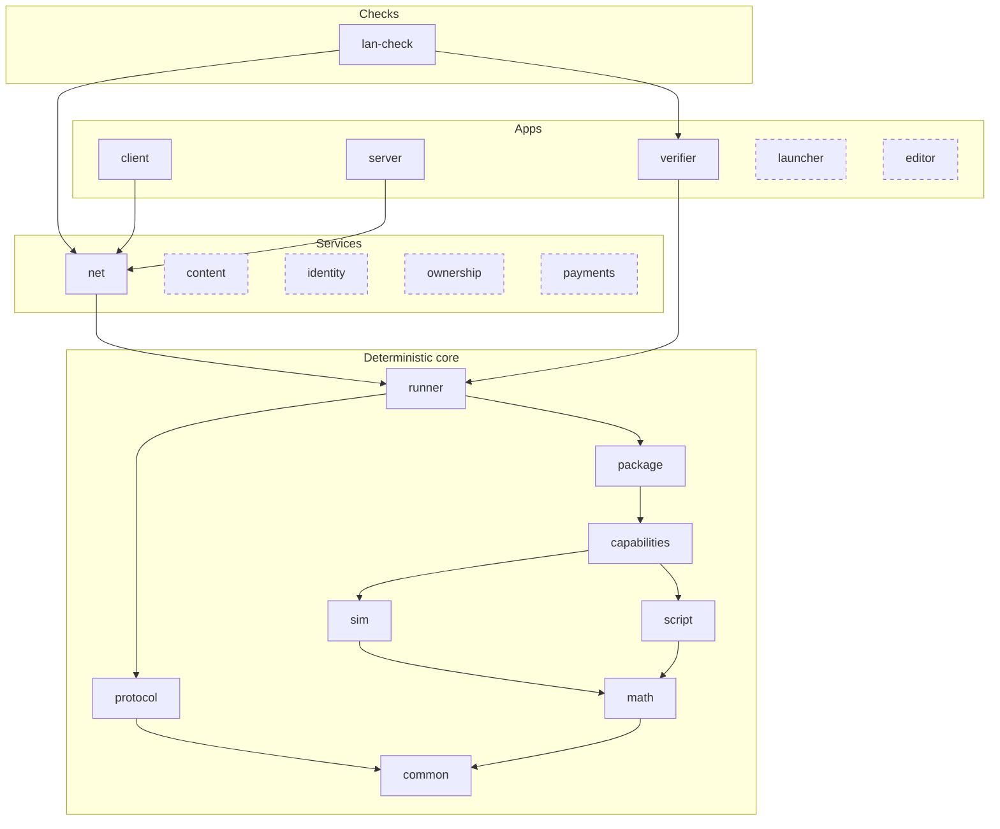

# Campfire — Engine Core

## Module map

Dashed: planned, as the table below marks it. `log` is left out: the binaries, `net` and `verifier` use it.

Each layer uses the layers below it.

## Modules

| Module | Status | Does |
| --- | --- | --- |
| `common` | built | The vocabulary that crates which do not depend on each other share: the player slot, ticks, segment seed and 32-byte values written as hex, and a package's fingerprint |
| `math` | built | Fixed-point numbers, 3D vectors, trig, exact 256-bit products, counter-based RNG |
| `protocol` | built | The open protocol: signatures, session key delegations, the connection's handshake, input chains, the seed chain and the session log ([Protocol Spec](05-protocol-spec.md)) |
| `sim` | built | Deterministic state and systems on `bevy_ecs`; no genre code |
| `script` | built | The Rhai host: compiles scripts, and runs each call under its limits; the script API itself is in `capabilities` ([Script API](08-script-api.md)) |
| `capabilities` | built | Mechanisms a mode combines, a module each: `combat`, `navigation`, `orders` and the rest ([Capabilities](04-capabilities/00-overview.md)) |
| `package` | built | Reads a mode's packages and every package it depends on, and runs the load checks of [Script API](08-script-api.md) |
| `runner` | built | Builds a match from checked packages: wires `sim`, the declared capabilities and `script`, feeds inputs; owns `SessionRules`, which builds a session's terms from the packages and checks terms on the server, the client and the verifier |
| `verifier` | built | CLI: replays a session log segment, checks the result |
| `lan-check` | built | The real server and bot clients over WebTransport on `127.0.0.1`, on request ([Testing and diagnostics](#testing-and-diagnostics)) |
| `server` | built | Host config, lifecycle, saves, validation, admin; a headless app, and a library the client runs on a thread for singleplayer |
| `net` | built | Lightyear over QUIC (WebTransport): handshake, replication; internal |
| `log` | built | The binaries' log output: text on standard error, and JSON lines into a file; the events a tool reads back from those lines |
| `launcher` | planned | Small app: fetches, checks and starts the engine release a server or replay names; server browser |
| `client` | built | Bevy app: rendering, input, UI, audio, prediction |
| `content` | planned | Package signatures, pinning, cache, Blossom fetch |
| `editor` | planned | Map and content editors |
| `identity` | planned | Nostr keys, session keys, listings, reputation |
| `ownership` | planned | License checks (optional) |
| `payments` | planned | Pools, hold invoices, wallet budgets (optional, separate repo) |

A module is built when the workspace has its crate, `campfire-<module>` in `source/crates/` or `source/checks/`, and planned when it does not yet. A test fails when this column and the workspace differ.

`sim` is pure: state and inputs in, next state out; no files, packages or signatures.

`lan-check` is a check, not an engine crate: it lives in `source/checks/`, apart from `source/crates/`, and nothing depends on it. Each crate's folder has its package's name, `campfire-` and the module: `source/crates/campfire-math/`, `source/checks/campfire-lan-check/`.

Dependencies: `server` and `client` → `net` → `runner`; `verifier` → `runner` → `package` → `capabilities` → `script`, `sim`; `runner` → `protocol`; `script` and `sim` → `math` → `common`; `protocol` → `common`. `log` depends on no engine crate; the binaries, `net` and `verifier` use it. The runner joins `protocol` and the packages, which name a package by the one `Fingerprint` of `common`. A type enters `common` only when two crates that do not depend on each other both name it, and only as a plain value: construction, parsing, display and serde, and no other logic. `common` depends on `serde` alone. Within `capabilities`, a module imports only from the capabilities below it.

Outside the engine crates: the reference MOBA and bots. The tests of `package` and `runner`, and `lan-check`, use them as test content; nothing else in the engine depends on them. Bots produce inputs like players, so replays never depend on bot code.

## Structural rules

These rules keep the code's structure from drifting. Each has a test that fails when it is broken, because a rule that only a review checks drifts again.

| Rule | Enforced by |
| --- | --- |
| One owner for each fact. A fact from the packages lives in one immutable book; a fact of the match lives in state; a fact of the running call lives in the frame. Nothing else holds a copy. | The state table test; the behaviour golden |
| A name becomes an id where it enters. After the load, no system looks up a name; a script call resolves its name once per call, with no allocation. Every lookup of an id by its name is a method whose name ends in `named`, so each call of one can be found. | The book builder's tests; the allowlist test of name lookups, which lists each file that calls one |
| The load refuses everything a match can refuse. A match start fails only on session terms: players, tick rate and seed. | `StartError` has no data case |
| A layer calls a higher layer only through a hook the higher layer registers: a capability adds to the script view through its column, to a call's frame through its part, to a call's effects through its effect types, each of which applies itself, and to the script API through its row of the capability table. | The layer test |
| Every order that matters is by stable id, and every rounding uses one helper. A system that spends something shared, takes ids or runs scripts walks its units through `Ordered`, a scratch that sorts the entities of its query by stable id: a query gives them in archetype order, which a component added to one unit, or a restore, changes. | The archetype-shuffle test |
| Each tick's work has a fixed limit, or a cost in proportion to the units that take part: no tick pays for a scan or a rebuild the other ticks do not. | The work record; the navigation bench |
| Restored state is checked like package data: a restore gives an error for every flaw, never a panic, and what it accepts plays on without one. Its times and counts stay within what a match makes: the tick, every time and every count are at most 2⁶², which no match reaches, so no sum of two overflows; every period is at least a tick; and every relation a system takes between two restored values, or between one and the books, holds, as the start of an attack under way, its resolve less its windup, is no sooner than tick 0. | Every state type's check, a required method of the state traits, which the compiler proves; the snapshot fuzz, which flips each byte of a proving match's snapshot, restores it, and plays five ticks on what restores; the structured fuzz, which puts into that snapshot values of each state type its decode accepts, the edges of every number among them, and does the same; a restore test at the limits of each state type's times and counts |
| Each rule of a network session has one owner on each side, and a client that follows the rules is never refused. | The net scenarios under load |
| `common` depends on no crate but `serde`. | The manifest test of `common` |

**Books.** A match's books are built by one pure function of its packages and a tick rate, with no world: the unit types and their tags, the tracks, the modifiers and the actions with their params and effect lists, the AIs, and the projectile and area specs. The package load calls it at the fastest rate the manifest allows, where a time counts the most ticks, so what the books cannot hold fails the load; a match calls it at its own rate and puts what it gives in place. The order of every id is the order the builder loads in: the tags, the tracks, every package's modifiers, then each package's actions and unit types, the mode's first. A script is named by its place in the order a match compiles them, and the hooks it defines come from what the load read of it, so no book needs a script host.

## Capabilities

The core has no genre code; a mode combines capabilities, one native mechanism each: [Capabilities](04-capabilities/00-overview.md).

## Lifecycle and sessions

- Engine states: **waiting** (players connect, packages load, start gates pass) → **running** → **ended** (result or aborted; the log is sealed, end hooks run).
- Start gates and end hooks are how optional modules join the lifecycle; the engine has no money code. The `payments` module adds a start gate that locks stakes and an end hook that settles them.
- Everything inside running (pick, rounds, buy time, overtime) is defined by the mode script.
- `ctx.end` is optional: a persistent world never calls it.
- A session outlives the server process. A match restores by replaying its own log from its latest checkpoint, from tick 0 when it has none; a world loads its latest checkpoint and replays the log after it. Players reconnect with the same session key.
- A session pauses by running no ticks, and runs at a game speed by running more or fewer ticks a real second; the sim reads no clock, so neither enters the log. Who may pause is the host's setting, and always the player in singleplayer.
- The server writes each input to the log before its tick runs and flushes the log from a background thread, so no tick waits on the disk; a crash loses at most the unflushed inputs, and clients resync to the restored state.
- A match that is not back within the host's restore window aborts. The window must end before any stake's hold invoice expires; a window of 0 means a crash always aborts.
- Script state is versioned; migration hooks convert saved state when a package version changes at restart.

## Inputs

Anything from outside enters the sim as a recorded input: player inputs (commands, each in its capability's format), bot inputs, player connects and disconnects, carry loads, admin commands, payment events, calendar time. If it is not in the log, the sim cannot depend on it.

Clients can join a running game at any time; they receive the current state of what they can see.

## Session log

- A match with no save is one segment; a persistent world checkpoints every few minutes, and every save is a checkpoint. Format: Protocol Spec.
- The verifier replays any segment from its checkpoint. Hosts set how long logs are kept.
- **Snapshot:** the postcard encoding of every sim component and resource, entities sorted by stable id, component types in an order the engine release fixes, script state maps sorted by key. Its format belongs to the engine release, not the protocol, and carries a data version, which a release raises whenever it changes the format.
- **State hash:** one BLAKE3 hash for each state type over the same bytes the snapshot holds, then one hash over the list of `(name, type hash)` ([Determinism Core](09-determinism-core.md)). The goldens compare it on every tick, on every OS in CI, and at the first mismatch the per-type hashes, to name the first divergence.
- **No slow tick for a checkpoint:** at the tick boundary the server copies only the components changed since the last checkpoint; a background thread applies them to its copy, encodes and hashes it, and writes the checkpoint record when done.

## Saves

A save is a checkpoint a player keeps: the snapshot at a tick boundary, and the session log before it. The player asks for one with a command, the mode with `ctx.save()` or at its `[saves] autosave_ms`; a mode that sets `[saves] by = "mode"` refuses the player's, as a hardcore mode does. A save costs no slow tick: it is written as every checkpoint is, from a copy, on a background thread.

- **Load.** Loading a save restores its snapshot and starts a new segment of the same session from it; the log after the save is dropped, so a load goes back in time. A singleplayer session may load any of its saves.
- **Converters.** A save loads on the release that made it and on every later one. Each release carries a converter from the data version before it, which rewrites a snapshot one way, as Factorio's map versions and Minecraft's DataFixerUpper do; loading an older save runs the converters in order. A release may drop the converters older than a point it names, and the launcher then fetches the last release that had them to convert in two steps. Script state converts by the packages' `state_version` and migration hooks, as for a world.
- **Verification.** A segment verifies on the release that recorded it, from its checkpoint. A converted save starts a new segment whose checkpoint the converter made outside the sim: the log names the release before and after, and the proof of the earlier segment ends at the conversion.
- **Carry.** The mode declares a carry schema, typed and versioned like script state. `ctx.carry` reads the carry the session loaded and writes the carry it will hand on; the server writes it out at the session's end and with each save. A session loads a carry as an external input at its start, so its log holds everything it read. A campaign's next mission, and a Diablo character's next play session, start from it.

## Scripting

`script` is its own crate in the deterministic core, so `sim` is testable without Rhai. Scripts run inside the sim tick; the API they call is the registry's ([Script API](08-script-api.md)).

- **Narrow game API.** Scripts never touch the ECS; they call the script API.
- **No `bevy_mod_scripting`.** It exposes all Bevy types and [pins Bevy patch versions](https://lib.rs/crates/bevy_mod_scripting_script).
- **Rhai engine:** `Engine::new_raw` with only the packages scripts need, in strict variables mode ([Engine enums](08-script-api.md#engine-enums)); no `eval`, imports, floats or time; `print` goes to debug logs only; a fixed hashing seed; never `unchecked`.
- **Operation limits:** a limit per call, and per-tick pools, which the manifest sets; counts are the same everywhere, so an over-budget script fails the same everywhere. Each hook runs in one pool:

  | Pool | Hooks |
  | --- | --- |
  | The player's, one per player slot | The calls that player causes: an action of a unit the player controls, its deliveries and modifiers, the player's quests and dialogue |
  | `think` | AI: `on_think`, `on_heard`; the hooks of an action or modifier whose source no player controls, or is gone |
  | `mode` | The mode's hooks: timers, inputs, deaths, region events, `on_level_up`, `on_wake`; a modifier with no source |
  | `systems` | `on_system` |
  | None, only the limit per call | `calc_damage` and `calc_heal`, pure and called once for each damage and each heal, so a crowded fight cannot spend a pool and change how they weigh ([Combat](04-capabilities/combat.md#damage-and-heals)); `on_generate`, under its own larger limit per call, `generate`, since it builds a region in one call |

  A call that finds its pool spent waits and runs first in the next tick, as AI and scripted systems do; a hook that cannot wait, a pure one, has no pool.
- **Other limits** (call depth, sizes) are engine constants, set explicitly, since Rhai's defaults differ between debug and release builds.
- **All or nothing per call.** State writes go to an overlay the call can read back; engine effects (damage, spawn, orders, timers) are queued. On success the overlay commits, then the effects apply in call order. Each capability keeps its own effect types in the call's frame, one queue a type, and each type applies itself: the queue records with each effect the apply of its type, so the script runtime names no capability, and no table can pair a type with another type's apply. On failure (error, overflow, limit) both are discarded, the sim emits a `script_error` event, and the tick goes on.
- **No hidden script state.** It is declared in a typed schema and stored in sim components; see [Script state](03-game-scripting.md#script-state).

## Backends

Collision, pathfinding and visibility each have one interface and pluggable backends, chosen per mode: [Navigation](04-capabilities/navigation.md), [Vision](04-capabilities/vision.md). Collision, within each layer bodies move on: circles on a plane (now), static 3D level geometry, or `physics`. A physics backend may use strictly deterministic floating point inside itself, such as Rapier's [`enhanced-determinism`](https://rapier.rs/docs/user_guides/rust/determinism/) mode, pinned per release and checked by the goldens on every OS; everything else stays fixed-point, and a NaN panics before it reaches a snapshot.

## Bevy

- `sim` depends on `bevy_ecs` only and is one schedule, which runs on one thread whatever features a build turns on: a tick's systems are too small to share, and Bevy's parallel executor made a 3v3 tick cost 2.5 times as much. The server and client run it inside Lightyear's fixed tick; the verifier and the tests run it in a bare `World`. The server never links the renderer. Pinned to [Bevy 0.19](https://bevy.org/news/bevy-0-19/); the script API and protocol expose no Bevy types.
- Sim systems touch only sim components, so Lightyear's components cannot change a result.
- The server records the inputs received since the last tick, then runs the tick. It hashes the state at checkpoints and at the result; a hash after every tick is opt-in.
- Each unit replicates to the clients whose vision group sees it. A client predicts only what its player controls (position, destination, death and respawn), with no input delay: Lightyear keeps its tick ahead of the server's present tick by half the round trip, a jitter margin, a sync error margin and one tick, so its inputs land in time; it is a full round trip ahead only of the newest server state it holds. A rollback reruns the sim from the server's state. It predicts movement, never a random outcome. The client builds the same books as the server from the packages it holds, at the rate the server's listing names, and installs them with the part of the mode no script runs: the map's metric, bounds, relations and pathing grid, and combat's bindings. So it predicts by the rules the server runs, and keeps no copy of its own. It derives its units' stats, tags and step from their type, level and modifiers, which the server sends, and starts their actions through the core's checks: an attack's or a cast's windup, and the cooldown when it goes off. It runs none of their effects, and no script: damage, launches, costs and a cast's effects come from the server. The server sends the teams' relations as a script changes them, as the client's targets and filters read them. It drops each sent input older than the deepest rollback Lightyear takes.
- `client` draws each unit with its own entity, interpolated between ticks; floats (`Transform`) exist only there.
- **Measured** (i9-13980HX): a packet's signature costs 17 µs to sign and 26 µs to check; a 3v3 tick at 20 Hz costs 55 µs on average and 363 µs at worst; a re-simulated tick of the lane 1v1 costs 3.2 µs. A 3v3 server tick with 6 packets costs at most about 0.5 ms of its 50 ms, and an 8-tick rollback at a 200 ms round trip at most about 3 ms. Decision 1 holds.

**Determinism rules for `sim`** (numbers, RNG and the state hash: [Determinism Core](09-determinism-core.md)):

- One fixed-tick schedule in ordered stages. Two systems with conflicting access and no order fail the build. A test builds the proving match's schedule with no automatic sync points, which Bevy adds between systems and which order them in passing, so every order the sim relies on is stated.
- Stable entity ids, never Bevy `Entity`, for the protocol, replays and every order that matters; Bevy [does not guarantee query order](https://docs.rs/bevy_rand/latest/bevy_rand/tutorial/ch02_basic_usage/index.html).
- Positions are 3D and fixed-point, 1 unit = 1 meter, within ±2²⁰ m. No floats outside a physics backend, no randomly seeded hash maps, no wall clock. An overflow panics in every build.
- The RNG is a cryptographic PRF, so clients cannot recover the seed from outcomes. A random value that decides an outcome never reaches a client before the log is published: clients predict effects, never results.

## Creator tools

- **Data schemas.** A JSON Schema for every data file is generated from the same types the engine reads, as the script API reference is generated from the registry, and a test fails when the checked-in schemas differ; an editor such as VS Code then completes and checks a package's TOML as a creator types. Generating them needs a schema crate, to be chosen and approved when the work starts.
- **Hot reload.** A local session in dev mode reloads changed scripts, data and text without a restart, as Roblox Studio and Dota 2's workshop tools do. A reload is no input the log can replay, so a dev session's terms say it is one, the verifier refuses its log, and a dev session takes no payments.

## Testing and diagnostics

- **Match scenarios** run whole matches between scripted players (`OrderScript`) in the test suite, through a modeled link of delay, jitter and loss on a manual clock, so each run repeats. Lightyear measures round trips by the wall clock, which varies with the machine's load, so the harness pins the measured round trip to the model's worst one, twice its delay and jitter, and its jitter to zero: Lightyear's own terms then give the lead that covers every modeled delay. Its frame costs under delay are not real ones.
- **Goldens.** Two pinned records of whole matches prove that a change keeps behaviour: the state golden, a BLAKE3 digest of each tick's state hash, which changes with the state's layout; and the behaviour golden, a digest of each tick's units (id, type, team, position, pools, death), deaths, damage and script failures, which does not. A change of layout alone updates only the state golden; a change of behaviour updates the behaviour golden and names itself. They run on the lane match; on the 3v3, played by scripted players in one match that holds a skirmish of first blood, mend and haste, and a tower that turns on a diver; a camp, whose wolf a hero leashes and two fell; and the lanes, where heroes farm the first waves; and on the proving match: a mode in `packages/test` that uses every capability the release runs, owned by the tests, with no balance to keep. A scripted player's orders name their units by role, as the player's hero or the enemy creep of least life near it, and the match resolves them to stable ids as it sends each. The 3v3's late rules, an inhibitor's fall and its super creeps, the warden's blessing and the core's fall, which no short match reaches at level 1, have a rules test that deals each fatal blow through the runner's world, with no golden and no replay.
- **One scripted match for each mode.** A new rule of a mode's match joins that mode's scripted match: its orders join the script, and its assertion reads its event in its own tick, not the final state. A new run is only for a check that a replayed match cannot hold, such as a change to the world that no input can make, as the late-rules test is: each run pays for the pick and its replay again. The state is hashed once a tick: the golden takes the trail's total.
- **Structure tests**: the layer test, which checks each module's imports against the capability table; the archetype-shuffle test, which plays the proving match with every unit moved to a new archetype before each tick, from the highest stable id down, so that queries meet the units of one archetype in reverse order, and checks both goldens; and the state table test, which checks each capability's state names.
- **Work record**: at the end of each stage of a redesign, the instruction count of the proving match and the 3v3, and the worst tick against the mean; a stage that makes either worse by more than 10 % says why.
- **LAN check** (`campfire-lan-check`, on request): the real server and two `client --bot` processes on `127.0.0.1`, and a bot with the wrong certificate that must fail and say why, checked from their JSON logs and by the verifier. Every order must take effect in its stamp tick, or in the tick after a frame in which the server caught up with a stall, which the server logs, if the order's stamp is among that frame's ticks. Each run keeps its logs in a directory of its own.
- **CI** runs the check chain and the LAN check on Linux, Windows and macOS; each platform's verifier then replays every platform's session log.
- **Logging** goes through `tracing`, never a print. `sim` and `capabilities` log nothing; they report through resources the runner logs. Binaries log to standard error, and to JSON lines with `CAMPFIRE_LOG`. An event a tool reads back is a typed `LogEvent`, with a round-trip test.

## Networking

The open protocol is separate from the transport:

- **`protocol`** (versioned, documented): session log (headers, signed inputs, checkpoints, results). Everything a replay needs.
- **`net`**: [Lightyear](https://github.com/cBournhonesque/lightyear) for transport, replication, prediction with rollback, interpolation and interest management. Lightyear replicates through [`bevy_replicon`](https://github.com/simgine/bevy_replicon), whose per-client entity visibility the visibility backend drives. Internal: client and server always run the same engine release.

## Libraries

Exact versions are pinned across the workspace. Each release tag also pins its Rust toolchain (`rust-toolchain.toml`) and `Cargo.lock`, so release builds are reproducible: anyone can rebuild a tag and compare hashes with the published binaries. Hashes cover the unsigned build outputs, because operating-system code signing changes the bytes. Release trust follows [TUF](https://theupdateframework.io/docs/security/): several offline keys, a signature threshold, and revocation.

| Area | Crate | Notes |
| --- | --- | --- |
| Fixed-point numbers, trig, sqrt | Own code in `math` | `Num`: `*` and `/` round to nearest, ties to even; exact decimal parsing; `sqrt` from an `f64` estimate that integer steps correct to the exact root, so the result does not depend on the float; `sin_cos`, `atan2` by series at high internal precision, within 0.501 ulp over the tests' sweeps. `fixed` rounds `*` toward −∞ and constants down, and `fixed_analytics` reaches 48 ulp in `atan2`, so neither is used ([Determinism Core](09-determinism-core.md)) |
| RNG | `blake3` keyed hash, wrapped in `math` | A PRF by specification, counter-based as in [Random123](https://www.thesalmons.org/john/random123/papers/random123sc11.pdf) but cryptographic, unlike Philox; BLAKE3's keyed known-answer vectors run in its tests. Range sampling is own code. No `rand`, which [may change output in minor releases](https://www.rustmax.net/library/rand-book/crate-reprod) |
| Protocol encoding | `postcard` | [Stable wire format](https://postcard.jamesmunns.com) since 1.0 |
| State hashes | `blake3` | At checkpoints and the result; per tick in the goldens |
| File and package fingerprints | `sha2` | SHA-256, as Blossom addresses blobs |
| Nostr | `nostr` in `protocol`, for delegations and their signatures; `nostr-sdk` and `nostr-connect` for the planned `identity` and `ownership` | Still alpha |
| Lightning (`payments`) | `nwc` | Drives the host's own wallet, including [hold invoices](https://getalby.com/blog/build-conditional-payment-logic-into-your-app). No embedded node |
